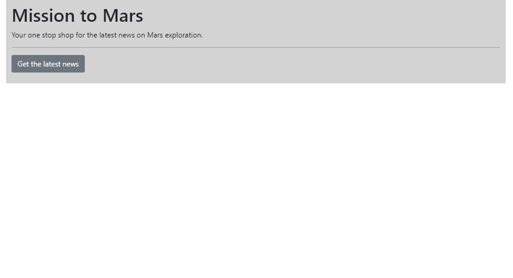
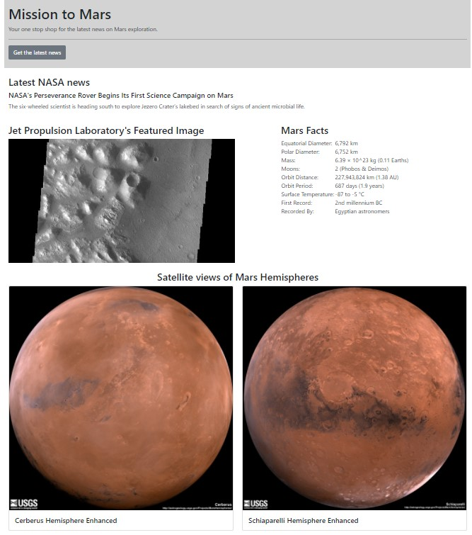

# webScraping-MarsNews

UofA Data Analytics Bootcamp Homework Assignment 12-Web Scraping and Document Databases

### Assignment Description

Build a responsive webpage that collects and displays information about Mars space exploration from the internet.

### Run Instructions
* Run 1-Missions_to_Mars/app.py
* Open the resulting local webpage
* Click "Get the latest news" button and wait for 30 seconds while web scraping tasks are conducted in Chrome browser.
* Review the latest news about Mars.

### Tools Utilized
| Foundation | Web Scraping | Webpage |
|----------|----------|----------|
| Python | Splinter | Flask | 
| Pandas | Beautiful Soup | Bootstrap |
| MongoDB |

### Source Data
* [NASA Mars News Site](https://mars.nasa.gov/news/)
* [JPL Featured Space Image](https://data-class-jpl-space.s3.amazonaws.com/JPL_Space/index.html)
* [Mars Facts](https://space-facts.com/mars/)
* [USGS Astrogeology](https://astrogeology.usgs.gov/search/results?q=hemisphere+enhanced&k1=target&v1=Mars)

### Project Content Descriptions
* 0-Assignment_Instructions: Instructions for completing the assignment.
* 1-Missions_to_Mars: Project content
    * mission_to_mars.ipynb: Webscraping development.
    * scrape_mars.py: mission_to_mars.ipynb converted into a callable Python script.
    * app.py: Flask app for webpage deployment
    * templates: Templates used for the webpage
        * index.html: Webpage displayed when MongoDB mars_factoids database is not present (i.e first time app.py is run).
        * scraped.html: Webpage displayed when MonboDB mars_factoids database is present.
* 3-Images: Webpage screen captures.

## Completed webpage

Before MongoDB mars_factoid database contains data.

After MongoDB mars_factoid database contains scraped data.

